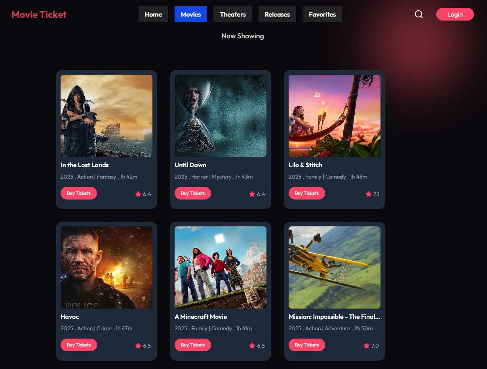
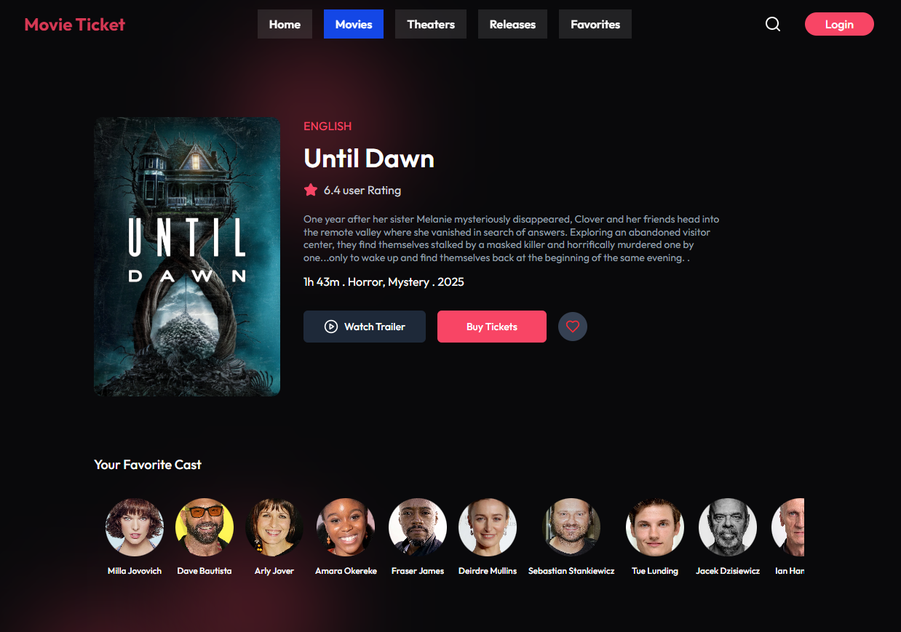
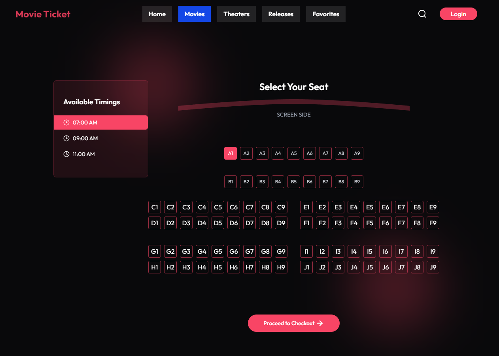
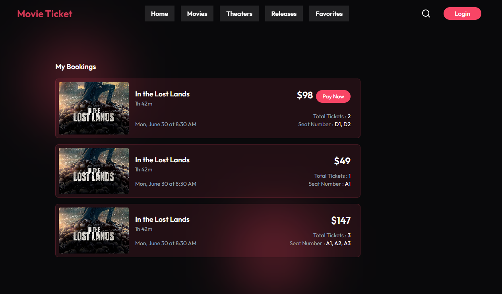

---

# Online Movie Ticket Management System

A full-stack web application for seamless movie ticket booking, built with **React**, **Node.js**, **Express**, and **MongoDB**.

Project Video Link : https://youtu.be/rbQwQtDBoeI?si=nip54LXZDVCSgn24

## Screenshots



 |


## Features

-   **User Authentication:** Secure sign up, login, and session management.
-   **Browse Movies:** View currently running and upcoming movies with details and trailers.
-   **Showtimes & Booking:** Select showtimes, choose seats, and book tickets in real-time.
-   **Booking History:** Users can view and manage their past and upcoming bookings.
-   **Admin Dashboard:** Manage movies, shows, and view all bookings.
-   **Responsive UI:** Modern, mobile-friendly interface for a smooth user experience.

## Tech Stack

-   **Frontend:** React, Vite, CSS
-   **Backend:** Node.js, Express
-   **Database:** MongoDB
-   **Authentication:** JWT (JSON Web Tokens)
-   **Deployment:** Vercel (or your preferred platform)

## Project Structure

```
<code_block_to_apply_changes_from>
```

## Getting Started

### 1. Clone the repository

```bash
git clone https://github.com/Mijan2001/movie-ticket
cd movie-ticket
```

### 2. Setup Backend

```bash
cd backend
npm install
# Create a .env file with your MongoDB URI and JWT secret
npm start
```

### 3. Setup Frontend

```bash
cd ../frontend
npm install
npm run dev
```

### 4. Open in Browser

Visit [http://localhost:5173](http://localhost:5173) to use the app.

## API Endpoints

-   `POST /api/auth/register` – Register a new user
-   `POST /api/auth/login` – Login
-   `GET /api/movies` – List all movies
-   `GET /api/shows` – List all shows
-   `POST /api/bookings` – Book tickets
-   ...and more

## Contributing

1. Fork the repo
2. Create your feature branch (`git checkout -b feature/YourFeature`)
3. Commit your changes (`git commit -am 'Add new feature'`)
4. Push to the branch (`git push origin feature/YourFeature`)
5. Open a Pull Request
